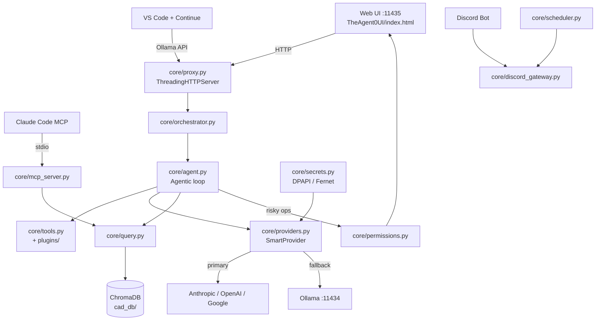

# System Design & Architecture

## Architecture Overview

**Key components**
- **Proxy** ([core/proxy.py](../../../core/proxy.py)) — ThreadingHTTPServer trên port `11435`, điểm vào duy nhất. Expose Ollama-compatible API + endpoints nội bộ.
- **Orchestrator** ([core/orchestrator.py](../../../core/orchestrator.py)) — chọn agent, inject context + tool catalog vào system prompt.
- **Agent loop** ([core/agent.py](../../../core/agent.py)) — structured `<tool_use>` blocks, **parallel tool calls per turn**, self-fix khi tool fail (`ModuleNotFoundError` → hint `install_package`).
- **SmartProvider** ([core/providers.py](../../../core/providers.py)) — primary (cloud) + fallback (Ollama), tự retry khi cloud fail.
- **Permission queue** ([core/permissions.py](../../../core/permissions.py)) — hàng đợi approve/deny cho write/exec tools, 120s timeout mặc định = deny.
- **RAG** ([core/query.py](../../../core/query.py) + [data/](../../../data/)) — chunk → embed (Ollama `mxbai-embed-large`) → ChromaDB.

**Stack**: Python 3.10+, stdlib `http.server`, ChromaDB, LangChain splitters, discord.py, `win32crypt` (DPAPI) / `cryptography` (Fernet).

## Data Models

**Runtime config flow** (see [implementation](../implementation/README.md) for details):

1. `config.py` — default, checked in.
2. `runtime_overrides.json` — đè `MODEL_PROVIDERS`, `AGENT_PROFILES`, `DISCORD_SETTINGS`, `AUTOMATION_TASKS`. API key được **mã hoá** trước khi ghi.
3. In-memory `smart_provider` reload khi user bấm **Apply Mode Changes** — không cần restart.

**Core entities**
- `Tool` — schema JSON, handler callable, `requires_permission` flag, category. Registry tại [core/tool_schema.py](../../../core/tool_schema.py).
- `AgentProfile` — `{system_prompt, model, tools[], large_model?}` trong `config.py::AGENT_PROFILES`.
- `PermissionRequest` — `{id, tool, args, requester_agent, scope}` → resolve qua `/api/permissions/resolve`.
- `DocumentChunk` — `{id, text, metadata{source, page, chunk_idx}, embedding}` trong ChromaDB.

## API Design

**External (Ollama-compatible, VS Code Continue / generic clients):**
- `POST /api/generate`, `POST /api/chat` — stream completion, `model` field accept cả virtual agent (`auto-agent`, `cad-rag`, …) lẫn tên model Ollama thật.
- `GET /api/tags` — list model, gồm cả virtual agent.

**Internal (Web UI / debug):**
| Endpoint | Method | Mục đích |
|---|---|---|
| `/api/config` | GET/POST | Đọc / cập nhật cấu hình (API key mask ở GET) |
| `/api/stats` | GET | 20 request gần nhất, thời gian xử lý, model đã dùng |
| `/api/permissions/pending` | GET | Các yêu cầu xin phép đang chờ |
| `/api/permissions/resolve` | POST | `{id, approved, scope}` |
| `/api/heartbeat` | POST | UI ping (5s). Không ping trong 45s → proxy tự tắt |
| `/api/shutdown` | POST | Tắt toàn bộ |

Header `X-Response-Time-Ms` và `X-Model-Used` đính kèm mọi response chat.

**Auth**: single-user local, không auth; API key cloud mã hoá ở đĩa.

## Component Breakdown

- **Frontend**: [TheAgent0UI/](../../../TheAgent0UI/) — single page với 5 tab (Chat, Agents, Connect, Daily Tasks, Change Mode). Permission modal với 4 scope (Deny / Allow once / Allow for session / Always this tool).
- **Backend core**: proxy, orchestrator, agent loop, provider, permissions, secrets.
- **Data pipeline**: [data/indexer.py](../../../data/indexer.py) (chunk → embed → store) + [scripts/update_rag.py](../../../scripts/update_rag.py).
- **Integrations**: Discord Gateway, MCP server, Automation Scheduler.
- **Plugins**: [core/plugins/](../../../core/plugins/) — auto-loaded via `core.tool_schema.load_plugins()`.

## Design Decisions

- **Ollama-compatible proxy** thay vì REST riêng → reuse được ecosystem (Continue, Ollama clients) không cần adapter.
- **Structured `<tool_use>` blocks + parallel tool calls** (ported từ claude-code) → throughput cao hơn, legacy `ACTION: {...}` vẫn parse back-compat.
- **Permission modal thay vì allowlist tĩnh** → user kiểm soát từng lần, giảm surprise.
- **Mã hoá theo OS** (DPAPI Windows / Fernet Linux-Mac) → tránh lệ thuộc keyring external.
- **Plugin system** → agent self-extend (`install_package` → retry) mà không cần sửa core.
- **Alternatives considered**: embed Ollama (từ chối — license/size), OAuth cho API key (overkill single-user), gRPC internal (không cần, HTTP đủ).

## Non-Functional Requirements

- **Performance**: first token < 2s (cloud) / < 5s (local 7B); RAG query < 3s cho ~100 docs.
- **Scalability**: single-user; ThreadingHTTPServer đủ cho parallel tool calls trong 1 turn.
- **Security**: API key mã hoá tại chỗ, không bao giờ log; write/exec tool qua permission; `install_package` chỉ nhận tên PyPI hợp lệ (regex), không URL / git+ / path.
- **Reliability**: heartbeat 45s tự tắt khi UI đóng; fallback cloud → local trong suốt 1 request; plugin lỗi không crash core (log + skip).
